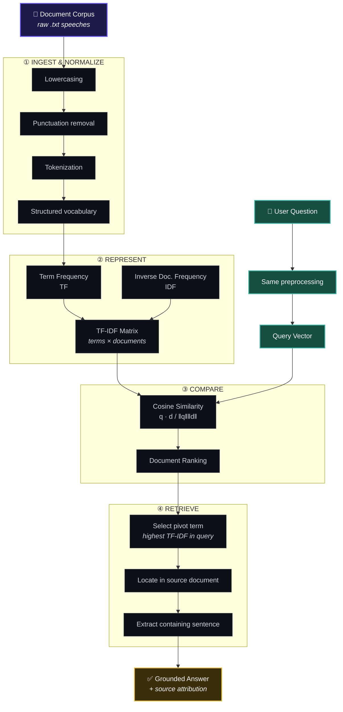
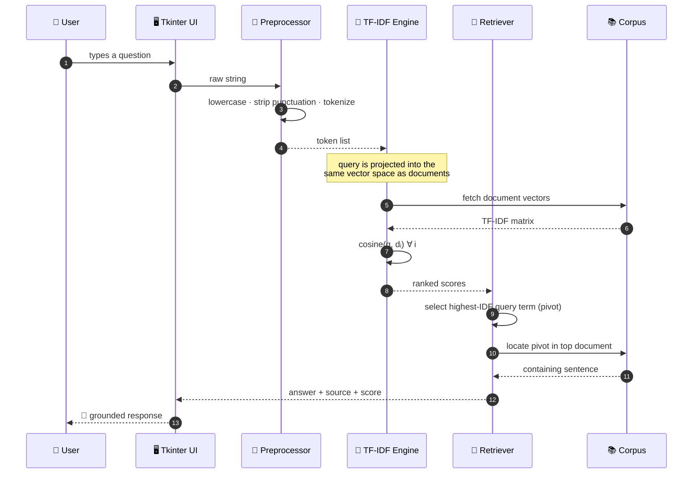
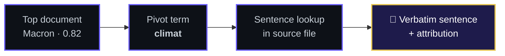
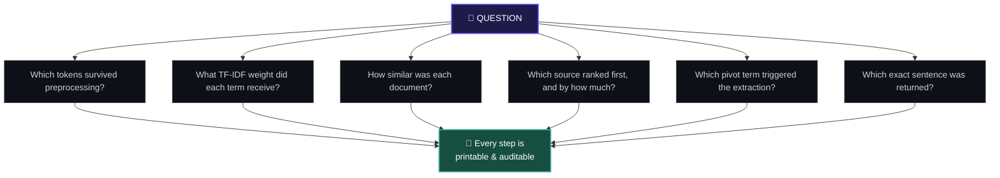
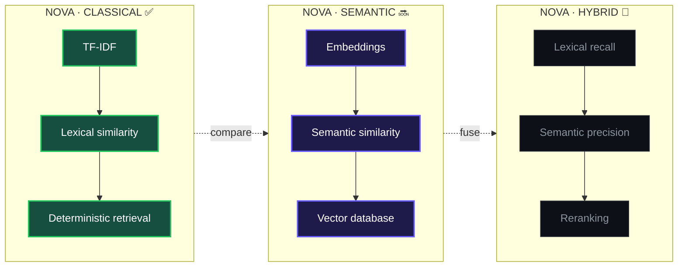

<!-- =========================================================
     NOVA — INTERPRETABLE CONVERSATIONAL RETRIEVAL ENGINE
     ========================================================= -->

<div align="center">




<br>

**A compact, fully interpretable NLP engine that turns a document corpus into a searchable vector space.**

*Built from scratch — no scikit-learn, no transformers, no hidden layers.*

<br>

<a href="https://github.com/eden2807/projetchatbotpythonL1/stargazers">

</a>
<a href="https://github.com/eden2807/projetchatbotpythonL1/network/members">

</a>
<a href="https://github.com/eden2807/projetchatbotpythonL1/commits">

</a>


<br>

<a href="#-00--overview"></a>
<a href="#-01--architecture"></a>
<a href="#-02--pipeline"></a>
<a href="#-03--the-mathematics"></a>
<a href="#-04--under-the-hood"></a>
<a href="#-05--quickstart"></a>

<br><br>


<br>

<sub><code>PYTHON</code> · <code>NLP</code> · <code>INFORMATION RETRIEVAL</code> · <code>TF-IDF</code> · <code>COSINE SIMILARITY</code> · <code>VECTOR SPACE MODEL</code></sub>

</div>

<br>


<br>

## 📖 Table of Contents

<table>
<tr>
<td valign="top" width="50%">

- [🛰 00 · Overview](#-00--overview)
- [🎬 Demo](#-demo)
- [🏗 01 · Architecture](#-01--architecture)
- [🌀 02 · Pipeline](#-02--pipeline)

</td>
<td valign="top" width="50%">

- [🧮 03 · The Mathematics](#-03--the-mathematics)
- [🔬 04 · Under the Hood](#-04--under-the-hood)
- [🚀 05 · Quickstart](#-05--quickstart)
- [🗺 Roadmap & FAQ](#-roadmap)

</td>
</tr>
</table>

<br>

---

## 🛰 00 · Overview

<table>
<tr>
<td width="58%" valign="top">

### Retrieval before generation.

**NOVA** is an *interpretable conversational retrieval engine* written in pure Python.

It ingests a corpus of French presidential speeches, converts language into numerical representations, compares a user's question against every document in the corpus, and returns a **real sentence from the best-matching source**.

The system deliberately follows a **classical information-retrieval approach** rather than a generative one. Every intermediate value — token, weight, vector, score — can be printed, plotted and audited.

> [!NOTE]
> NOVA does not *invent* answers. It *finds* them. Every output is traceable back to a specific sentence, in a specific speech, by a specific president.

</td>

<td width="42%" valign="top">

### ⚙️ System Card

```yaml
type:         Retrieval Engine
language:     Python 3.x
domain:       Natural Language Processing
model:        Vector Space Model
weighting:    TF-IDF (hand-rolled)
similarity:   Cosine
grounding:    Source-anchored
interface:    Tkinter (customtkinter) · browser (zero-dep)
dependencies: customtkinter (desktop UI only) — engine is stdlib-only
```

<br>

| | |
|:--|:--|
| **Status** | `● functional prototype` |
| **Principle** | `interpretability > complexity` |
| **Params** | `0 learned` |
| **Corpus** | `French presidential speeches` |

</td>
</tr>
</table>

<div align="right"><a href="#-table-of-contents"><sub>▲ back to top</sub></a></div>

---

## 🎬 Demo

<div align="center">


<sub><i>Ask in natural language → NOVA ranks the corpus → returns the grounded sentence.</i></sub>

</div>

<br>

```console
$ python main.py

  ╔══════════════════════════════════════════════════════════╗
  ║  NOVA · interpretable retrieval console                  ║
  ╚══════════════════════════════════════════════════════════╝

  [ ✓ ] corpus loaded ............................ 8 documents
  [ ✓ ] preprocessing complete ................... 4 stages
  [ ✓ ] vocabulary built ......................... 12 431 terms
  [ ✓ ] TF-IDF matrix ............................ 12 431 × 8
  [ ✓ ] engine ready

  › Comment une nation peut-elle agir pour le climat ?

  ├─ query terms retained ......... climat · nation · agir
  ├─ best match ................... Macron        (cos = 0.82)
  ├─ pivot term ................... climat        (idf = 0.42)
  └─ source ...................... speeches/Macron.txt

  » "Le climat est notre combat commun, et il exige de chaque
     nation un engagement immédiat et concret."
```

> [!TIP]
> Drop a screen recording at `assets/demo.gif` — a 6-second loop showing a question and its answer is the single highest-impact addition you can make to this page.

<div align="right"><a href="#-table-of-contents"><sub>▲ back to top</sub></a></div>

---

## 🏗 01 · Architecture



### Query lifecycle



<div align="right"><a href="#-table-of-contents"><sub>▲ back to top</sub></a></div>

---

## 🌀 02 · Pipeline

### ① A question enters as language

```text
"Comment une nation peut-elle agir pour le climat ?"
```

### ② It is stripped to its lexical skeleton

```diff
- Comment une nation peut-elle agir pour le climat ?
+ ["comment", "une", "nation", "peut", "elle", "agir", "pour", "le", "climat"]
```

### ③ And re-emerges as a point in ℝⁿ

```text
QUERY VECTOR  ·  dim = |V|

 climat   nation   agir    école    europe   guerre   ...
┌──────┬────────┬────────┬───────┬────────┬────────┬─────┐
│ 0.81 │  0.47  │  0.18  │ 0.00  │  0.00  │  0.00  │ ... │
└──────┴────────┴────────┴───────┴────────┴────────┴─────┘
   ▲        ▲        ▲
   │        │        └─ common verb, low IDF → low weight
   │        └────────── moderately distinctive
   └─────────────────── rare & topical → dominates the direction
```

### ④ Every document is scored against it

```text
                          COSINE SIMILARITY

 Macron       ████████████████████████████████████░░░░░░░░   0.82  ◄ best
 Chirac       ████████████████████░░░░░░░░░░░░░░░░░░░░░░░░   0.46
 Mitterrand   ███████████████░░░░░░░░░░░░░░░░░░░░░░░░░░░░░   0.34
 Sarkozy      ███████░░░░░░░░░░░░░░░░░░░░░░░░░░░░░░░░░░░░░   0.17
 Hollande     █████░░░░░░░░░░░░░░░░░░░░░░░░░░░░░░░░░░░░░░░   0.11
 Giscard      ██░░░░░░░░░░░░░░░░░░░░░░░░░░░░░░░░░░░░░░░░░░   0.04

                    0.0                                  1.0
```

### ⑤ And the answer is *extracted*, never invented



> [!IMPORTANT]
> The final answer stays **anchored to the original corpus**. NOVA cannot hallucinate — the worst it can do is retrieve a *poorly matched* sentence, which the similarity score immediately exposes.

<div align="right"><a href="#-table-of-contents"><sub>▲ back to top</sub></a></div>

---

## 🧮 03 · The Mathematics

Everything NOVA does reduces to four equations. All of them are implemented by hand.

<br>

### ① Term Frequency

*How often does a term appear **within** a document, normalised by that document's length?*

$$
\mathrm{tf}(t, d) = \frac{f_{t,d}}{\sum_{t' \in d} f_{t',d}}
$$

Raw counts would let long speeches dominate every query. Dividing by document length turns a count into a **rate**.

<br>

### ② Inverse Document Frequency

*How **rare** — and therefore how informative — is a term across the whole corpus?*

$$
\mathrm{idf}(t, D) = \log_{10} \frac{N}{\mathrm{df}(t)}
$$

where $N$ is the number of documents in the corpus and $\mathrm{df}(t)$ the number of documents containing $t$.

<br>

### ③ TF-IDF Weight

*The product: frequent **here**, rare **elsewhere** → high signal.*

$$
w_{t,d} = \mathrm{tf}(t, d) \times \mathrm{idf}(t, D)
$$

<br>

### ④ Cosine Similarity

*The angle between question and document — insensitive to length.*

$$
\cos(\theta) = \frac{\vec{q} \cdot \vec{d}}{\|\vec{q}\| \, \|\vec{d}\|} = \frac{\sum_i q_i d_i}{\sqrt{\sum_i q_i^2} \, \sqrt{\sum_i d_i^2}}
$$

<br>

<details>
<summary><b>🔍 Why cosine and not Euclidean distance?</b></summary>

<br>

Because **document length would dominate the metric**.

A 40-page speech and a 2-page speech on the same topic sit far apart in Euclidean terms — their vectors have very different magnitudes — yet they point in nearly the same *direction*.

```text
  d_euclid(q, d) = √( Σᵢ (qᵢ − dᵢ)² )        ← length-sensitive

  cos(θ)         = (q · d) / (‖q‖ ‖d‖)       ← direction only
                 ∈ [0, 1]                     ← length-invariant
```

Cosine similarity asks *"is this about the same thing?"* rather than *"is this the same size?"* — which is exactly the question a retrieval engine needs to answer.

</details>

<details>
<summary><b>🔍 Why <code>log</code> in the IDF term?</b></summary>

<br>

Without the logarithm, a term appearing in 1 document out of 100 would be weighted **100×** more than a term appearing in every document — an absurdly steep penalty that lets a single rare typo hijack an entire query.

The log **compresses the dynamic range**, so rarity is rewarded *smoothly*:

| Documents containing *t* | Raw ratio `N / df(t)` | `log₁₀` |
|:---|---:|---:|
| 1 / 100 | 100 | 2.00 |
| 10 / 100 | 10 | 1.00 |
| 50 / 100 | 2 | 0.30 |
| 100 / 100 | 1 | **0.00** |

Note the last row: a term present in *every* document carries **zero** discriminative information — the formula eliminates stop-words automatically, without ever needing a stop-word list.

</details>

<div align="right"><a href="#-table-of-contents"><sub>▲ back to top</sub></a></div>

---

## 🔬 04 · Under the Hood

### Four core operations

<div align="center">

| `01` | `02` | `03` | `04` |
|:---:|:---:|:---:|:---:|
| 🧹 **PREPROCESS** | 🧮 **VECTORIZE** | 📐 **COMPARE** | 🎯 **RETRIEVE** |
| normalize text | build TF-IDF | cosine similarity | extract source |
| ↓ | ↓ | ↓ | ↓ |
| `clean corpus` | `sparse vectors` | `ranked scores` | `grounded answer` |

</div>

<br>

### Reference implementation

The whole engine, conceptually, in a handful of functions — no external library involved.

```python
from math import log10, sqrt
from collections import Counter


def tokenize(text: str) -> list[str]:
    """Language → normalized token stream."""
    text = text.lower()
    text = "".join(c if c.isalpha() or c.isspace() else " " for c in text)
    return text.split()


def term_frequency(tokens: list[str]) -> dict[str, float]:
    """Raw counts, normalized by document length."""
    counts, n = Counter(tokens), len(tokens)
    return {t: c / n for t, c in counts.items()}


def inverse_document_frequency(corpus: list[list[str]]) -> dict[str, float]:
    """Rarity across the corpus. Terms present in every document → weight 0."""
    N = len(corpus)
    vocabulary = {t for doc in corpus for t in doc}
    return {
        t: log10(N / sum(t in doc for doc in corpus))
        for t in vocabulary
    }


def tf_idf(corpus: list[list[str]]) -> list[dict[str, float]]:
    """The matrix: one sparse weight vector per document."""
    idf = inverse_document_frequency(corpus)
    return [
        {t: tf * idf[t] for t, tf in term_frequency(doc).items()}
        for doc in corpus
    ]


def cosine_similarity(a: dict[str, float], b: dict[str, float]) -> float:
    """Angle between two sparse vectors. 0 = orthogonal, 1 = identical."""
    shared = a.keys() & b.keys()
    dot = sum(a[t] * b[t] for t in shared)
    norm = sqrt(sum(v * v for v in a.values())) * sqrt(sum(v * v for v in b.values()))
    return dot / norm if norm else 0.0
```

> [!NOTE]
> The sparse `dict` representation is a deliberate choice: with a 12 000-term vocabulary and 8 documents, a dense matrix would be **99 % zeros**. Intersecting keys makes similarity computation proportional to the *query* length, not to the vocabulary size.

<br>

### 🩹 A bug the interpretability work found — before / after

Building a 3D inspector for this vector space meant tracing every number back to its source, which surfaced a real bug in `creer_vecteur_tf_idf_question` (`TF_IDF.py`): the query-weighting step was being handed the wrong matrix.

That function multiplies each query term's raw count by its corpus-wide IDF. The call site (`traitement_questions_reponses.py`) was passing `matrice_tf_idf_corpus_transposee` — one row **per document** — instead of `matrice_idf_corpus` — one row **per word**. The lookup loop then bounded itself on `len(matrice_idf_corpus)`, which, given the wrong matrix, evaluated to `9` (8 documents + a header row) instead of `1680` (the vocabulary size). In practice, only query terms that happened to land in the first 9 vocabulary columns ever got IDF-weighted; every other term silently kept its raw count, as if `idf = 1`.

The default demo query for the new visualizer exposes it cleanly:

| | query weights | best match | pivot term |
|---|---|---|---|
| **Before** | `le`=1, `pour`=1, `agir`=1, `climat`=1, `comment`=1 — *all equal, no IDF applied* | Macron · cos = **0.049** | **`le`** *(a stopword, idf = 0.0)* |
| **After** | `agir`=0.602, `climat`=0.903, `comment`=0.903 — *`le`, `pour` correctly drop out (idf = 0.0)* | Macron · cos = **0.064** | **`climat`** |

Two more issues surfaced the same way and were fixed alongside it, at the source — not patched around in a downstream script:

- **No lowercasing on the user's question** (`traitement_question_utilisateur`): the corpus is lowercased before cleaning, but the incoming question never was. `"Comment agir pour le Climat"` silently dropped both capitalized words — exactly the ones carrying the signal.
- **Term frequency was a raw count, not a frequency** (`creer_matrice_tf`): `tf(t, d)` was never divided by document length, so a longer speech systematically outweighed a shorter one on every shared term — the exact distortion TF-IDF's normalization exists to prevent.

Every score in the engine — IDF, TF-IDF, cosine similarity — now also carries full floating-point precision instead of being rounded mid-pipeline (the old code did `round(x, 2)` on IDF and TF-IDF, and `round(x, 3)` on cosine similarity, before the value was ever used in another computation). Display-time rounding for the UI's text answers is unaffected; what changed is that the *engine's own arithmetic* no longer loses precision before it's done using the number.

<br>

### Complexity

| Operation | Time | Space | Notes |
|:---|:---:|:---:|:---|
| Preprocessing | `O(N · L)` | `O(N · L)` | `N` documents, `L` average length |
| IDF construction | `O(N · V)` | `O(V)` | `V` = vocabulary size |
| TF-IDF matrix | `O(N · L)` | `O(N · v̄)` | `v̄` = avg. unique terms per doc |
| Query scoring | `O(N · q)` | `O(q)` | `q` = query length, sparse intersection |
| Sentence retrieval | `O(L)` | `O(1)` | single linear scan |

<br>

### Module map

| File | Responsibility |
|:---|:---|
| `main.py` | Desktop app entry point · customtkinter UI · event loop |
| `TF_IDF.py` | TF-IDF matrices · IDF · query vectorization |
| `math_vecteurs.py` | Vector ops · cosine similarity |
| `string_manager.py` | Text cleaning · sentence extraction |
| `presidents.py` | Corpus/file bookkeeping · corpus-wide stats |
| `export_vectorspace.py` | Computes `docs/data/vectorspace.json` for the browser visualizer |
| `docs/` | Interactive 3D vector-space visualizer — static site, zero dependencies |
| `speeches/` | Raw corpus — untouched source of truth |
| `cleaned/` | Normalized corpus — reproducible intermediate artifact |

<br>

### Why interpretable?

Modern language systems hide their decision process behind billions of learned parameters. NOVA goes the other way — **every question has an answer**:



That makes NOVA useful not only as a chatbot prototype, but as a small **laboratory for understanding classical NLP and information retrieval**.

<br>

### NOVA ≠ Generative AI

<table>
<tr>
<th align="left" width="50%">🔷 NOVA · Retrieval</th>
<th align="left" width="50%">🔶 Generative language model</th>
</tr>
<tr><td>Retrieves existing information</td><td>Generates new token sequences</td></tr>
<tr><td>Explicit, human-readable TF-IDF weights</td><td>Learned dense embeddings</td></tr>
<tr><td>Transparent, closed-form similarity metric</td><td>High-dimensional learned inference</td></tr>
<tr><td>Answer provably tied to the corpus</td><td>Answer can extend beyond source text</td></tr>
<tr><td><b>0 parameters</b> · deterministic</td><td>10⁹–10¹² parameters · stochastic</td></tr>
<tr><td>Runs on a laptop, instantly</td><td>Requires accelerated hardware</td></tr>
<tr><td>Fails <i>visibly</i> (low score)</td><td>Fails <i>fluently</i> (hallucination)</td></tr>
</table>

<div align="right"><a href="#-table-of-contents"><sub>▲ back to top</sub></a></div>

---

## 🚀 05 · Quickstart

> [!NOTE]
> **Two things you can run here.** The retrieval engine (TF-IDF, cosine, everything under [🧮 03](#-03--the-mathematics)) is pure Python standard library — nothing to install to compute anything. The desktop UI (`main.py`) now uses [`customtkinter`](https://pypi.org/project/customtkinter/) for its look, so it needs one `pip install`. The browser-based 3D vector-space visualizer (`docs/`) has **zero dependencies** — plain HTML/CSS/JS, no build step, no CDN, no npm.

### Requirements


### Installation

```bash
# 1 · Clone
git clone https://github.com/eden2807/projetchatbotpythonL1.git
cd projetchatbotpythonL1

# 2 · Install the one dependency (desktop UI only)
pip install -r requirements.txt
```

<details>
<summary><b>🐧 Linux: <code>ModuleNotFoundError: No module named 'tkinter'</code></b></summary>

<br>

Tkinter ships with Python on Windows and macOS, but is packaged separately on most Linux distributions:

```bash
# Debian / Ubuntu
sudo apt install python3-tk

# Fedora
sudo dnf install python3-tkinter

# Arch
sudo pacman -S tk
```

</details>

### Run the desktop app

```bash
python main.py
```

1. The corpus is indexed at startup (`speeches/` → `cleaned/` → TF-IDF matrix, in memory).
2. Type a question in natural language (French).
3. NOVA returns the best-matching sentence, its source document, and the similarity score.

<br>

### Run the interactive 3D vector-space visualizer

The browser instrument reads a pre-computed snapshot of the vector space (`docs/data/vectorspace.json`) — it does not talk to `main.py` or run any Python at request time. It needs a real HTTP server (not a double-clicked `file://` page) because it `fetch()`es its data:

```bash
cd docs
python -m http.server 8000
```

Then open **http://localhost:8000** in a browser. Query box on the left, 3D LSA/MDS sphere in the center, ranking and extracted answer on the right. `Ctrl+C` in the terminal to stop the server.

<details>
<summary><b>Regenerating the vector-space data</b> (after adding/editing a speech in <code>speeches/</code>)</summary>

<br>

Run from the **repository root**, not from `docs/` — it rebuilds `docs/data/vectorspace.json` from the current corpus using the real engine functions (`TF_IDF.py`, `math_vecteurs.py`, …), including the Jacobi eigendecomposition and the LSA/MDS projections:

```bash
python export_vectorspace.py
```

Two IDF weighting variants are available (`export_vectorspace.py`'s own flag, independent of `main.py`'s engine):

```bash
python export_vectorspace.py --idf smooth    # default — lowest angular distortion on this corpus
python export_vectorspace.py --idf classic   # the same formula main.py's engine uses
```

Reload the browser page afterward — no server restart needed.

</details>

### Run the tests

```bash
python -m unittest discover -s tests
```

<br>

### Repository map

```text
NOVA
│
├── 📁 speeches/                raw document corpus  ·  untouched source of truth
│   ├── Nomination_Chirac1.txt
│   ├── Nomination_Macron.txt
│   └── ...
│
├── 📁 cleaned/                 normalized corpus  ·  reproducible intermediate
│
├── 📁 docs/                    interactive 3D vector-space visualizer (static site)
│   ├── index.html · style.css · app.js
│   └── data/vectorspace.json   pre-computed embeddings, generated by export_vectorspace.py
│
├── 📁 tests/                   unittest suite
│
├── 📁 assets/                  header.svg · footer.svg · demo.gif
│
├── 🐍 main.py                  desktop app entry point · customtkinter interface
├── 🐍 ui_theme.py              desktop UI colors, labels, small testable UI rules
├── 🐍 TF_IDF.py                TF-IDF matrices · query vectorization
├── 🐍 math_vecteurs.py         vector ops · cosine similarity
├── 🐍 string_manager.py        text cleaning · sentence extraction
├── 🐍 presidents.py            corpus/file bookkeeping · corpus-wide stats
├── 🐍 files_manager.py / lists_manager.py   small IO/list utilities
├── 🐍 export_vectorspace.py    computes the JSON the browser visualizer reads
│
├── 📄 requirements.txt         desktop UI's one dependency (customtkinter)
├── 📄 README.md                system documentation
│
└── 📄 LICENSE
```

<div align="right"><a href="#-table-of-contents"><sub>▲ back to top</sub></a></div>

---

## 🗺 Roadmap

The natural trajectory: from **lexical** matching, to **semantic** matching, to a **hybrid** of both.



**Planned extensions**

- [x] Manual TF-IDF implementation
- [x] Cosine similarity ranking
- [x] Source-grounded sentence retrieval
- [x] Tkinter interface
- [ ] Retrieval evaluation benchmark (precision@k, MRR)
- [ ] Interactive similarity visualization
- [ ] Semantic embeddings + vector store
- [ ] Hybrid lexical/semantic search with reranking
- [ ] Larger and more diverse corpora
- [ ] Explainability dashboard (per-term contribution to score)
- [ ] Web interface
- [ ] Structured citation system

<br>

---

## ❓ FAQ

<details>
<summary><b>Why build TF-IDF by hand when scikit-learn exists?</b></summary>

<br>

Because the point was never to *use* TF-IDF — it was to *understand* it.

`TfidfVectorizer` is three lines of code and teaches nothing about smoothing, normalization choices, sparse representation, or why the logarithm is there. Implementing it manually forces every design decision into the open.

The library version is what you ship. The hand-rolled version is what makes you able to debug the library version.

</details>

<details>
<summary><b>How does NOVA handle a question with no good match?</b></summary>

<br>

It says so — via the score. A maximum cosine similarity near `0` means the query vector is nearly orthogonal to every document: the corpus contains nothing on that topic.

This is a structural advantage over generative systems, which produce equally fluent output whether or not they have relevant grounding.

</details>

<details>
<summary><b>Why French presidential speeches?</b></summary>

<br>

They form an ideal teaching corpus: thematically distinct (each president has recognizable priorities), stylistically homogeneous (same register, same genre), publicly available, and small enough that results can be verified by reading the source.

When NOVA ranks a climate question toward Macron and a decolonization question toward de Gaulle, you can confirm it by hand — which is exactly what an interpretability exercise requires.

</details>

<details>
<summary><b>What are the known limitations?</b></summary>

<br>

Honest list:

- **No semantics.** *"voiture"* and *"automobile"* are unrelated dimensions. Pure lexical overlap.
- **No morphology.** Without stemming or lemmatization, *"agir"* / *"agissons"* / *"action"* are three distinct terms.
- **No word order.** Bag-of-words discards syntax entirely — *"la France aide l'Europe"* and *"l'Europe aide la France"* are identical vectors.
- **Single-sentence answers.** Retrieval granularity is one sentence; multi-hop or multi-document questions are out of scope.

Each of these is a deliberate simplification — and each maps directly onto a roadmap item.

</details>

<details>
<summary><b>▸ Project origins</b></summary>

<br>

NOVA began as an early university Python project on text analysis and classical natural language processing.

The constraint was explicit: implement the core mechanisms manually rather than relying on NLP frameworks —

`corpus preprocessing` → `term-frequency analysis` → `inverse document frequency` → `TF-IDF matrix construction` → `vector operations` → `cosine similarity` → `document ranking` → `sentence retrieval`

The result is a first-principles exploration of the mathematical and computational foundations underlying every modern retrieval system — including the "R" in RAG.

</details>

<div align="right"><a href="#-table-of-contents"><sub>▲ back to top</sub></a></div>

---

## 🤝 Contributing

Contributions, ideas and corrections are welcome.

```bash
git checkout -b feature/your-idea
git commit -m "feat: add your idea"
git push origin feature/your-idea
```

Then open a Pull Request. For substantial changes, please open an issue first to discuss the direction.

---

## 📄 License

Released under the **MIT License** — see [`LICENSE`](LICENSE) for details.

---

<br>

<div align="center">

<a href="https://github.com/eden2807">

</a>
<a href="https://github.com/eden2807/projetchatbotpythonL1/issues">

</a>

<br><br>

<sub>⭐ If this helped you understand how retrieval actually works, consider starring the repo.</sub>

<br>



</div>
